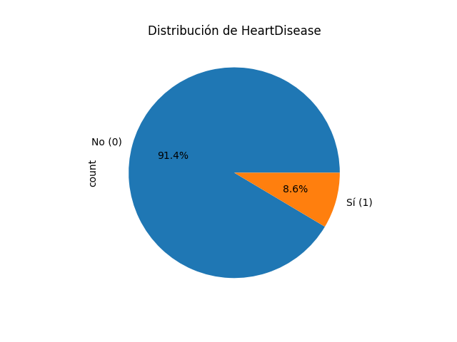

</a>
<h1>❤️Corazón Digital-Prediciendo Enfermedades Cardíacas con Machine Learning 🤖</h1>

#### Autor: [Alex Marzá Manuel](https://www.linkedin.com/in/alex-marza-data-science/)

Este proyecto se abordará la aplicación del machine learning para predecir enfermedades cardíacas, brindando una descripción detallada del trabajo realizado. En él, se proporcionará información sobre el contexto y la importancia de este problema de salud pública, destacando la necesidad de herramientas predictivas para el diagnóstico temprano.

# Indice

<dl>
  <dt><a href="#introducción">1. Introducción </a></dt>
      <dd>Descripción detallada del problema y objetivo a tratar</dd>

  <dt><a href="#data_compr">2. Desarrollo</a></dt>
      <dd>Cómo se tratan los datos</dd>

  <dt><a href="#estructura">3. Estructura de carpetas</a></dt>
      <dd>Organización del proyecto</dd>
    
  <dt><a href="#construccion">4. En formación </a></dt>
      <dd>El futuro del proyecto</dd>
    
---
# 🚀 1. Introducción

#### Descripción del proyecto
Este proyecto se centra en la detección temprana y prevención de enfermedades cardíacas, que son una de las principales causas de muerte en los Estados Unidos. A través del análisis de factores de riesgo clave como presión arterial alta, colesterol elevado, tabaquismo, estado diabético, obesidad y falta de actividad física, se busca desarrollar un modelo de aprendizaje automático capaz de predecir la condición cardíaca de los individuos. 

Al aplicar técnicas computacionales avanzadas, se pretende identificar patrones y tendencias en los datos clínicos, lo que permitirá una detección temprana y un enfoque preventivo para mejorar la salud cardiovascular. Este proyecto busca brindar una herramienta eficiente para los profesionales de la salud en la toma de decisiones y promover una atención personalizada y preventiva para reducir la carga de las enfermedades cardíacas en la población.

#### Características del problema

Características detalladas

    
A continuación, se muestra una breve descripción con el significado de cada variable para una mejor comprensión acerca del problema a tratar.
 
**HeartDisease**: Encuestados que alguna vez informaron haber tenido una enfermedad cardíaca coronaria (CHD) o un infarto de miocardio (IM).

**IMC**: Índice de Masa Corporal (IMC).

**Smoking**: ¿Ha fumado al menos 100 cigarrillos en toda su vida? (La respuesta Sí o No).

**AlcoholDrinking**: Bebedores frecuentes (hombres adultos que toman más de 14 tragos p/semana y mujeres adultas que toman más de 7 tragos p/semana)

**Stroke**: ¿Alguna vez le dijeron usted tuvo un accidente cerebrovascular?

**PhysicalHealth**: Su salud física, incluye enfermedades y lesiones físicas, ¿cuántos días durante los últimos 30 días su salud física no fue buena?

**MentalHealth**: Pensando en su salud mental, ¿durante cuántos días durante los últimos 30 días su salud mental no fue buena? (0-30 días).

**DiffWalking**: ¿Tiene serias dificultades para caminar o subir escaleras?

**Sex**: ¿Hombre o Mujer?

**AgeCategory**: Categoría de edad de catorce niveles.

**Race**: Valor de raza/etnicidad imputado.

**Diabetic**: ¿Alguna vez le dijeron usted tenía diabetes?

**PhysicalActivity**: Adultos que informaron haber realizado actividad física o ejercicio durante los últimos 30 días además de su trabajo habitual.

**GenHealth**: ¿Diría usted que, en general, su salud es...?

**SleepTime**: en promedio, ¿cuántas horas duermes en un período de 24 horas?

**Asthma**: ¿Alguna vez le dijeron usted tenía asma?

**KidneyDisease**: sin incluir cálculos renales, infección de la vejiga o incontinencia, ¿alguna vez le dijeron que tenía una enfermedad renal?

**SkinCancer**: ¿Alguna vez le dijeron si usted tenía cáncer de piel?
    

# 🔧 2. Desarrollo

#### ¿Qué dificultades podemos encontrar?

- **Calidad y limpieza de los datos**: Los conjuntos de datos clínicos pueden contener errores y valores faltantes. Se requiere un análisis exhaustivo y técnicas de limpieza para asegurar datos de calidad.
    

    
Comprobación de datos faltantes por columnas

    

    df.isnull().sum()

    

    

- **Selección de características relevantes**: Con múltiples variables disponibles, es importante determinar qué características son más relevantes para predecir enfermedades cardíacas. Se necesita un análisis exploratorio y técnicas de selección de características.
    

    
De la columna de "Sex"

    

    Python

    df["Sex"][df["Sex"] == "Female"] = 0

    df["Sex"][df["Sex"] == "Male"] = 1

    

    

- **Desequilibrio de clases**: Puede haber una proporción desigual entre casos positivos y negativos de enfermedad cardíaca. Esto puede afectar el rendimiento del modelo y requerir técnicas de muestreo o ajuste de pesos.

    

    
Ver imagen

    
    

    

    
Técnica de desbalanceo de datos

    

    BalancedBaggingClassifier(base_estimator=DecisionTreeClassifier(),
                                    sampling_strategy='auto',
                                    replacement=True,
                                    random_state=0,)

    

    

- **Elección del modelo adecuado**: Se debe seleccionar y ajustar cuidadosamente el modelo de aprendizaje automático más adecuado para el problema. Requiere experimentación y comparación de modelos para encontrar el más efectivo.
    

    
Modelo de Random Forest Classifier

    

    Creamos el pipeline con Random Forest Classifier
    pipeline = Pipeline([
        ('rfc', RandomForestClassifier(random_state=0))
    ])

    Definimos los parámetros a probar en el RandomizedSearchCV
    parameters = {
        'rfc__n_estimators': [50, 80, 100],
        'rfc__max_depth': [5, 8, 10],
        'rfc__min_samples_split': [2, 5, 10],
        'rfc__min_samples_leaf': [1, 2, 4],
        'rfc__class_weight': ['balanced', None]
    }

    

    

- **Interpretación de resultados**: Comprender y comunicar los resultados del modelo de manera efectiva puede ser un desafío. Se necesita interpretar los hallazgos y explicar las predicciones de forma comprensible para diferentes audiencias.
    

    
Explicación métricas

    

    En el problema que se está tratando de resolver, el objetivo principal es lograr una alta recall, ya que indica la capacidad del modelo para identificar correctamente la mayoría de los casos positivos. Esto es especialmente importante en la detección de enfermedades cardíacas, donde es fundamental identificar adecuadamente a los pacientes que realmente padecen dicha enfermedad.

    

    

# 📁 3. Estructura de carpetas

A continuación se detallan las carpetas y los requisitos de cada una:

1. **data**: Contiene los datos utilizados en el proyecto. Se compone de las siguientes subcarpetas:
   - `raw`: Contiene los datos en su formato original, es decir, se encuentran sin procesar.
   - `processed`: Almacena los datos procesados después de realizar todas las transformaciones necesarias.
   - `train`: Contiene los datos de entrenamiento utilizados para entrenar el modelo.
   - `test`: Almacena los datos de prueba utilizados para evaluar el modelo.
   - `comparation_models_metrics`: Contiene los datos de las métricas de cada modulo para poder observar mejor sus respectivas diferencias.

2. **notebooks**: Se encuentran los archivos Jupyter Notebook que contienen los distintos desarrollos del proyecto. Estan estructurados de la siguiente manera.
   - `01_EDA.ipynb`: Contiene el análisis exploratorio de datos.
   - `02_Preprocesamiento.ipynb`: En él se desarrollan las transformaciones y limpiezas, incluyendo el feature engineering.
   - `03_Entrenamiento_Modelo.ipynb`: Se plasma el entrenamiento de los modelos junto con su hiperparametrización correspondiente.
   - `04_Evaluacion_Modelo.ipynb`: Contiene la evaluación de los modelos, es decir, las métricas de evaluación, interpretación de variables, etc.

3. **src**: En él se almacenan los distintos archivos fuente de Python que implementan las funcionalidades clave del proyecto. Se estructura de la siguiente manera:
   - `data_processing.py`: Se trata del código para procesar los datos de la carpeta `data/raw` y guardar los datos procesados en la carpeta `data/processed`.
   - `model.py`: Se plasma el código para entrenar y guardar el modelo entrenado utilizando los datos de la carpeta `data/train`.
   - `evaluation.py`: Se muestra el código para evaluar el modelo utilizando los datos de prueba de la carpeta `data/test` y generar métricas de evaluación.

4. **models**: En esta carpeta se almacenarán los archivos relacionados con el modelo entrenado. Dicha carpeta estará compuesta por:
   - `trained_model.pkl`: Se trata del modelo entrenado guardado en formato pickle.
   - `model_config.yaml`: Es el archivo con la configuración del modelo entrenado, es decir, sus parámetros.

5. **app**: En dicha carpeta se mostrarán los archivos necesarios para el despliegue del modelo en Streamlit y estará compuesta por:

   - `app.py`: Se plasma el ódigo para la aplicación web que utiliza el modelo entrenado (Streamlit,...).
   - `requirements.txt`: En él se especifica las dependencias del proyecto para poder ejecutar la aplicación.

5. **docs**: Contiene la documentación adicional relacionada con el proyecto. Esta compuesta por:
   - `imagenes`: Se muestran las diversas imágenes utilizadas para el proyecto
   - `presentación.pptx`: Se trata del archivo de la presentación a negocio.

# 📈 4. En formación

El presente proyecto de Machine Learning se encuentra en una fase temprana de desarrollo, en la cual se han realizado importantes avances. Se ha llevado a cabo la limpieza y análisis de datos, así como la evaluación de diferentes modelos para la predicción de enfermedades cardíacas (Heart Disease).

Hasta el momento, hemos logrado desarrollar scripts de Python que han permitido realizar el preprocesamiento de los datos, explorar y analizar la información relevante, y evaluar distintos modelos de Machine Learning. Estos avances nos han brindado una sólida base para continuar con el desarrollo del proyecto.

Sin embargo, es importante destacar que aún queda un extenso camino por recorrer. Planeamos realizar mejoras continuas en el preprocesamiento de datos, incluyendo técnicas adicionales de feature engineering y selección de características relevantes. Asimismo, nos enfocaremos en la optimización de los modelos y la exploración de nuevas técnicas de Machine Learning que puedan mejorar la precisión de la predicción de enfermedades cardíacas.

Además, se llevará a cabo un análisis exhaustivo de los resultados obtenidos hasta el momento, con el fin de identificar posibles sesgos, limitaciones y áreas de mejora. Este análisis nos permitirá realizar ajustes pertinentes en el enfoque metodológico y en la selección de características relevantes para mejorar la capacidad de predicción del modelo.

En resumen, aunque hemos realizado importantes progresos en este proyecto de Machine Learning para la predicción de enfermedades cardíacas, reconocemos que aún hay mucho trabajo por hacer. Nos comprometemos a continuar evaluando, analizando y mejorando el modelo, con el objetivo de desarrollar una herramienta precisa y confiable que pueda ayudar en la detección temprana y prevención de enfermedades cardíacas.

